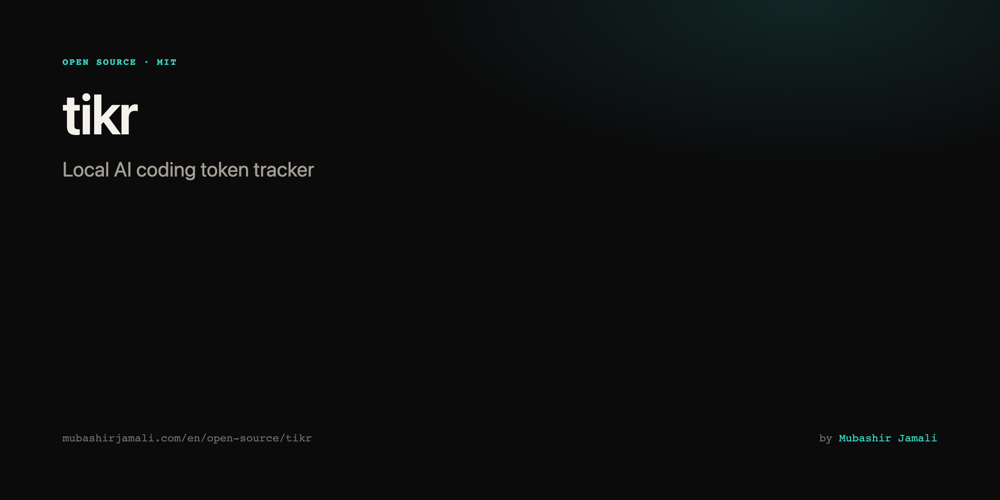
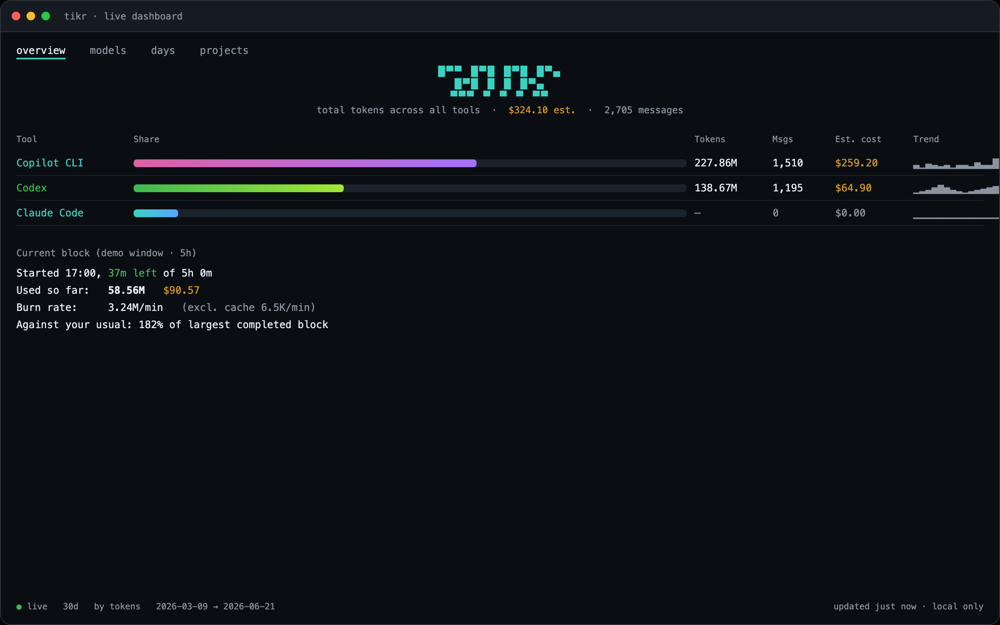
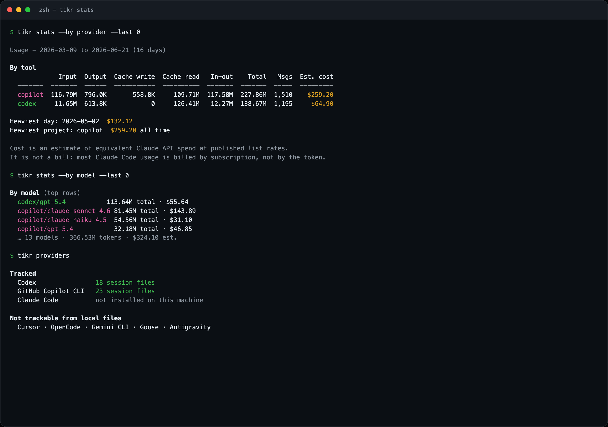

# tikr



Track your AI coding tool token usage. One command starts a background service that watches each
tool's own local session files and records how many tokens you used, per tool, per model, per day,
per project.

Nothing is sent anywhere. The tool reads local files and writes to `~/.tikr`.

## Tools tracked

| Tool | Source |
|---|---|
| **Claude Code** | `~/.claude/projects/**/*.jsonl` |
| **Codex** | `~/.codex/{sessions,archived_sessions}/**/*.jsonl` |
| **GitHub Copilot CLI** | `~/.copilot/session-state/*/events.jsonl` |
| **Grok CLI** | OTLP logs (`grok_code.api_request`). Session files have no token counts. |

```bash
tikr providers   # what is tracked, what is not, and why
```

A tool is added only once its on-disk format has been verified against a real installation.
OpenCode, Antigravity, Cursor, Goose and Gemini CLI were each checked and do **not** record token
usage locally, so they are listed as untrackable rather than guessed at. Grok CLI was checked the
same way: `~/.grok/sessions` has no per-turn tokens, so tikr reads Grok from its opt-in OTEL log
stream instead (`tikr telemetry`). `docs/PROVIDERS.md` has the evidence.


## Screenshots





Portfolio: **[mubashirjamali.com/en/open-source/tikr](https://mubashirjamali.com/en/open-source/tikr)** · [How I built it](https://mubashirjamali.com/en/writing/building-tikr-with-claude-code)

## Install

**macOS / Linux** — one line (no Node required for the binary):

```bash
curl -fsSL https://raw.githubusercontent.com/mubashirjamali101/tikr/main/install.sh | bash
```

**Windows (PowerShell)**:

```powershell
irm https://raw.githubusercontent.com/mubashirjamali101/tikr/main/install.ps1 | iex
```

Press Enter if prompted. That downloads the standalone binary, puts `tikr` on your `PATH`, then
runs `tikr start`: it detects Claude Code, Codex, Copilot CLI and Grok if they are installed,
reads existing session files so stats start from current usage, configures Grok's OTEL stream,
prints the all-time by-tool table, and registers the service to run at login. Set
`TIKR_SKIP_START=1` to install the binary only.

Binaries for macOS (arm64/x64), Linux (x64/arm64) and Windows (x64) ship on every
[release](../../releases).

<details>
<summary>From source (development)</summary>

```bash
git clone https://github.com/mubashirjamali101/tikr.git && cd tikr
pnpm install && pnpm run build
# or: ./build.sh && YES=1 ./install.sh
```

</details>

## Use

The install script already ran this. Run it again after installing a new coding tool, or to
repair setup:

```bash
tikr start
```

That detects which supported tools are on the machine, reads their existing session files so stats
start from current usage (Claude Code, Codex, Copilot CLI), configures Grok's live OTEL feed,
starts the background service, and registers it to run at login. The first run prints the all-time
by-tool table. Then, whenever you want to know where your tokens went:

```bash
tikr stats
```

```
By tool
                Input  Output  Cache write  Cache read    Total    Msgs  Est. cost
  -----------  ------  ------  -----------  ----------  -------  ------  ---------
  claude-code   1.12M  14.34M      158.70M       6.37B    6.54B  22,515   $5118.21
  codex        72.94M   3.36M            0     800.05M  876.34M   7,906    $224.18
  copilot      23.49M  224.8K        99.2K      20.77M   44.59M     514     $48.37
```

```bash
tikr stats --by provider   # which tool is costing you
tikr stats --by model      # namespaced as provider/model
```

## The dashboard

```bash
tikr
```

An interactive terminal dashboard. It watches every tracked tool's files rather than polling, so a
new message appears in **about half a second** (measured: 0.42s).

```
 overview   models   days   projects
────────────────────────────────────────────────────────────────────────────
                          █▀▀     █▀█ █▀█ █▀▄
                          █▀█       █   █ █▀▄
                          ▀▀▀  ▀    ▀   ▀ ▀▀
            total tokens across all tools   $5205.08 est.   23,879 messages

Tool                  Share                       Tokens     Msgs   Est. cost  Trend
Claude Code           ████████████████████████▏    6.64B   22,754    $5174.67  ▃▁▄▃▂▃▁▃▃▂▅▃▃█
Codex                 ▋                          129.82M    1,081      $29.52  ▁▁▁▁▁▁▁▁▁▁▁▁▁▁
GitHub Copilot CLI                                 5.67M       44       $0.89  ▁▁▁▁▁▁▁▁▁▁▁▁▁▁
────────────────────────────────────────────────────────────────────────────
● live  30d  by tokens  2026-05-15 to 2026-08-11         updated 8:37:34 PM
```

| Key | |
|---|---|
| `tab` / `1`-`4` | switch view: overview, models, days, projects |
| `↑` `↓` / `j` `k` | move selection, `g` / `G` for first and last |
| `d` | cycle window: 7d, 30d, 90d, all time |
| `s` | cycle sort: tokens, cost, messages, name |
| `r` | rescan now |
| `?` | help |
| `q` | quit |

The days view stays in date order whatever the sort, because re-ranking a timeline by size
destroys the only thing it is for. Projects list every tool that touched them, attributed to the
heaviest.

It is written against the raw terminal with no dependencies, adapts to any width by shedding
columns rather than wrapping, and restores your terminal on exit, on a signal, and on a crash.
Piping it (`tikr > file`) prints the plain report instead of escape sequences.

## Commands

| Command | What it does |
|---|---|
| `start` | Detect installed tools, configure them, index history, start the service, run it at login |
| `ui` / `live` | Live-updating dashboard |
| `stop` | Stop the service (`--disable` also removes it from startup) |
| `status` | Service state, and where data is kept |
| `providers` | Which tools are tracked, and which cannot be |
| `stats` | Show usage (see below) |
| `statusline` | One line of usage for Claude Code's own prompt (`--install` prints the setup) |
| `scan` | Run one ingest pass now (`--dry-run` writes nothing) |
| `telemetry` | How to have Claude Code push usage here as it happens |
| `enable` / `disable` | Manage the startup registration on its own |
| `reset` | Delete all recorded statistics (requires `--yes`) |

```bash
tikr stats --by day --last 7     # last week, day by day
tikr stats --by week             # or --by month, --by project, --by provider
tikr stats --by block            # five-hour blocks, the unit you are limited by
tikr stats --by hour             # heatmap of hour against weekday
tikr stats --since 2026-08-01    # an explicit window
tikr stats --json                # pipe into something else
tikr stats --csv                 # or into a spreadsheet
```

## Are you about to run out

Claude Code meters usage in rolling five-hour blocks, so that is the unit that matters, and every
report shows the live one:

```
Current block
  Started 17:00, 37m left of 5h 0m
  Used so far:   849.88M  $567.96
  Burn rate:     3.24M/min  (6.5K/min excluding cache)  $130.03/hour
  On this pace:  973.05M  $650.66 by 22:00
  Against your usual: 182% of 464.51M, past it (largest of 106 completed blocks, no limit ever recorded)
```

Two figures are given for the burn rate because cache reads outnumber output here by two orders of
magnitude, so a single rate would only ever describe the size of the context.

"Against your usual" is measured, not looked up. Subscription limits are not published, so this
tool does not pretend to know yours: it reports the 90th percentile of your own blocks that
actually hit a limit, and says so. Until a limit has been hit it reports your largest block instead
and labels that differently, because the two are very different claims.

## In your prompt

```bash
tikr statusline --install
```

Prints the block to add to `~/.claude/settings.json`. It does not edit the file for you.

```
Opus 5  session $25.80  today $767.61  block $568.78 (36m left)  3.55M tok/min
```

Fields drop from the right as the terminal narrows. It reads state and never writes it, so it
cannot race the background service.

## Configuration

Optional, `~/.tikr/config.json`. Only options that already exist as flags:

```json
{
  "defaults": { "last": 30, "week-start": "monday" },
  "commands": { "stats": { "by": "block" } },
  "projects": { "-Users-me-code-my-app": "my app" }
}
```

A flag always beats the command block, which beats the defaults. A malformed file is reported once
and otherwise ignored. The schema for editor completion is `docs/config-schema.json`.

## Why your totals shrink elsewhere, and not here

Claude Code deletes session transcripts older than `cleanupPeriodDays` (**default 30**) at startup.
The window slides one day every day, so any tool that answers "how much have I used?" by reading
the files currently on disk reports a number that **falls over time**. That is why a total can go
from 100M yesterday to 70M today: the tokens were real, the evidence was deleted.

`tikr` is an **append-only ledger of its own**. It reads each transcript once, from a byte
offset, and folds the result into its own store. After that the file is irrelevant:

- a deleted transcript **never** subtracts from your totals
- a write that would lower the recorded total is **refused** (`StateRegressionError`), which is what
  makes "only ever grows" a guarantee rather than a convention
- a damaged state file is **recovered from a backup** and the damaged copy is quarantined, never
  silently overwritten
- deleted transcripts are **counted and reported**, so you can see your raw history being pruned
  instead of trusting a shrinking number

```
Deleted by Claude  40 transcripts (their tokens are still counted here)
```

Claude Code's own retention setting is left alone; this tool does not depend on it and does not
change it. If you would rather ignore existing history entirely and count only from now on:

```bash
tikr start --no-backfill
```

## Storage: encrypted, append-only, machine-bound

History is kept in an **encrypted, hash-chained ledger** at `~/.tikr/ledger.jsonl`.
`state.json` is only a fast cache of it and can be rebuilt at any time.

| Property | How |
|---|---|
| **Encrypted** | AES-256-GCM. The key is derived with scrypt from your machine identity plus a per-install random salt. Nothing readable is written to disk. |
| **Non-transferable** | The machine identity (`IOPlatformUUID` on macOS, `/etc/machine-id` on Linux, `MachineGuid` on Windows) is part of the key. Copy the directory to another computer and every record fails to decrypt. |
| **Non-editable** | GCM authentication means any byte edit fails decryption, and each entry hashes the one before it, so removing, inserting, or reordering entries is detectable. |
| **Retained forever** | Append-only. Nothing in the tool rewrites, truncates, or expires an entry. |

```bash
tikr verify              # walk the chain, decrypt every entry
tikr verify --rebuild    # restore the cache from the ledger
```

```
Entries:  7  (60,642 bytes)
Machine:  hardware id

Chain intact. Every entry decrypts and links to the one before it.
Nothing has been edited, removed, or reordered.
```

Files are `0600` inside a `0700` directory.

### What this does not protect against

**Anything the tool can decrypt, any process running as you can also decrypt.** The service runs
unattended, so the key must be derivable without a passphrase, which means it is derivable by you.
Encryption here defeats copying the data to another machine, reading it out of a backup or synced
folder, and editing it in place. It is not protection from the owner of the account, and deleting
the whole directory is always possible - though `verify` will then report an empty ledger rather
than pretending the history was always that short.

## How it works

Claude Code already writes a JSONL transcript for every session under
`~/.claude/projects/<project>/<session>.jsonl`. Each assistant entry carries the model and its
token usage. This tool tails those files (tracking a byte offset per file, so a scan reads only
what is new), folds the usage into daily and per-project buckets, and stores the result in
`~/.tikr/state.json`.

Counting correctly is less obvious than it looks. Two facts, both measured against real
transcripts and both handled in `src/core/ingest.ts`:

- One API message is written as **several JSONL entries**, one per content block, each carrying an
  identical copy of `usage`. Summing entries inflates output tokens by about **2.2x**.
- Where duplicate entries differ, they are **partial-then-final streaming updates** with output
  growing, so the right rule is to take the max per field within a message id, not the first, the
  last, or the sum.

`docs/LESSONS.md` records the measurements behind both.

## Optional: the telemetry feed

Claude Code can push token and cost metrics straight to `tikr` over OpenTelemetry. Run
`tikr telemetry` for the exact setup, or in short:

```bash
export CLAUDE_CODE_ENABLE_TELEMETRY=1
export OTEL_METRICS_EXPORTER=otlp
export OTEL_EXPORTER_OTLP_PROTOCOL=http/json
export OTEL_EXPORTER_OTLP_ENDPOINT=http://localhost:4318
```

```bash
tikr start --otlp
```

This adds three things transcripts cannot give you:

- **Claude Code's own cost figure**, instead of an estimate from list rates
- a **main / subagent / auxiliary** breakdown
- **push delivery**, so numbers move without waiting for a file write

The receiver binds to `127.0.0.1` only. Telemetry counts the *same tokens* as the transcripts, so
the two are reported in separate sections and never added together.

### Why not intercept the network?

Reading Claude Code's HTTPS traffic would mean installing a root CA in your system trust store and
routing every request through a local MITM proxy, which would then see your OAuth token on every
call, and would break whenever Claude Code updates or pins certificates. It would also buy roughly
one second over simply watching the transcript files, and it would still not produce the cost figure
or the subagent split that the telemetry feed gives you for free. The OTLP receiver is a real
network listener; it is just the supported one.

## About the cost column

Cost is an **estimate of equivalent Claude API spend** at published list rates. Most Claude Code
usage runs on a subscription rather than metered API billing, so treat it as "what this would have
cost on the API", not as a bill.

Rates come from a table generated from LiteLLM's public price list and committed to the repo, so
pricing is exact and offline at the same time: the tool still never opens a socket. Regenerate with
`pnpm run rates`. Cache writes and reads are priced from their own published figures rather than
from multipliers, the 5-minute and 1-hour cache tiers are tracked separately, and a model with a
published long-context tier is billed at that tier for requests that exceed it.

Every figure carries a basis, and the report names the weakest one present:

| Basis | Meaning |
|---|---|
| exact | A published rate for that exact model |
| family | The model is not in the table, so its family's rate was used |
| partial | Computed, but a surcharge that applies could not be included |

`partial` exists for fast mode. Fast requests are billed at a multiple of the standard rate, the
multiplier is model-specific and published for only some models, and the published values range
from 2.0 to 6.0 inside a single family. So fast usage is counted in its own bucket, priced with the
multiplier when one is known, and otherwise charged at the standard rate with a line saying the
surcharge is missing. Understating visibly beats overstating invisibly.

The telemetry feed reports Claude Code's own cost figure instead, which is a measurement rather
than an estimate. The two are never added together.

## Autostart

| Platform | Mechanism |
|---|---|
| macOS | launchd LaunchAgent at `~/Library/LaunchAgents/com.tikr.agent.plist` |
| Linux | systemd user unit at `~/.config/systemd/user/tikr.service` |
| Windows | `HKCU\Software\Microsoft\Windows\CurrentVersion\Run` |

Remove it with `tikr disable` (or `tikr stop --disable`).

## Configuration

| Variable | Default | Purpose |
|---|---|---|
| `TIKR_HOME` | `~/.tikr` | Where this tool stores state |
| `CLAUDE_CONFIG_DIR` | `~/.claude` | Where Claude Code stores its data |

## Development

```bash
pnpm run check     # lint, typecheck and tests
pnpm run rates     # regenerate the pricing table from LiteLLM
```

`docs/` has the rest: [CONTRIBUTING](docs/CONTRIBUTING.md) for the layout,
[PROVIDERS](docs/PROVIDERS.md) to add a tool, [LESSONS](docs/LESSONS.md) for the measured facts the
counting depends on, and [plans](docs/plans/README.md) for why each subsystem is built the way it is.

Contributions are welcome. If a change touches counting or pricing, verify it against real
transcripts and say what you measured: green tests have passed while the tool silently counted
nothing.

## License

MIT, Copyright (c) 2026 Mubashir Jamali. See [LICENSE](LICENSE).
